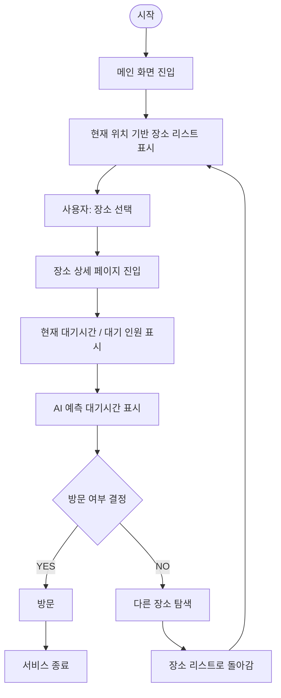
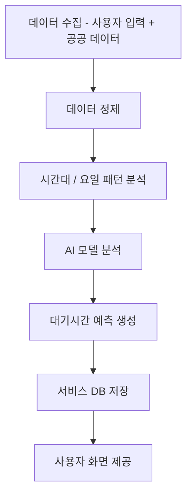

<!-- 2주차 발표 -->
<details>
  <summary><strong>2주차 발표</strong></summary>

# 2주차 발표
# 대기시간 공유 서비스 (가제)

---
> 다양한 장소(식당·카페·병원·관공서 등)의 **현재 대기시간/대기 인원**을 사용자들이 직접 공유하고,  
> 방문 전에 혼잡도를 예측할 수 있도록 돕는 서비스

---

## 1. 서비스 아이디어

사람이 많이 몰리는 장소에서는 대기시간이 자주 발생합니다.

이 서비스는 사용자가 특정 장소를 검색하면 다음 정보를 확인할 수 있도록 합니다.

- **현재 대기시간**
- **현재 대기 인원**

또한 실제로 방문한 사용자가 대기 정보를 직접 입력해, 다른 사용자에게 **현장 기반 정보**를 공유합니다.

---

## 2. 해결하려는 문제

대부분의 장소는 **방문하기 전에는 대기 상황을 알기 어렵습니다.**

예를 들어,

- 맛집에 갔는데 줄이 너무 길어서 **다시 이동**해야 하거나
- 병원에 갔는데 대기 환자가 많아 **오래 기다려야** 하는 경우가 있습니다.

결국 사람들은 **도착한 뒤에야** 상황을 알게 되어:

- 시간을 낭비하고
- 일정이 꼬이며
- 불필요한 이동이 발생합니다.

---

## 3. 서비스 목적

이 서비스의 목적은 **방문 전에 대기 상황을 확인**할 수 있게 하는 것입니다.

사용자들이 실제 대기 정보를 공유하면, 다른 사용자들은 다음과 같은 이점을 얻습니다.

- 불필요한 이동 감소
- 대기시간 예측 가능
- 시간 사용 효율 향상

---

## 4. 관련 서비스 조사

현재 지도 기반 서비스에는 다음이 있습니다.

- **Naver Map**
- **Google Maps**

이 서비스들은 장소 정보/리뷰는 제공하지만 **실시간 대기시간을 정확히 제공하진 않습니다.**

또한 레스토랑 예약 서비스인 **Catch Table**은 일부 예약 기능을 제공하지만,
**특정 업종 중심**이라는 한계가 있습니다.

---

## 5. 개선 방향 (차별점)

그래서 **사용자 참여 기반**으로 "실제에 가까운 대기 정보"를 모으는 서비스를 기획했습니다.

사용자가 방문한 장소의

- 대기시간
- 대기 인원

을 입력하면 다른 사용자들이 더 신뢰도 높은 정보를 확인할 수 있습니다.

### 참여/신뢰도 강화 방안

- 대기정보 입력 시 **포인트 보상**
- 리뷰 작성 시 **추가 보상**
- 허위 정보에 대한 **제재(신고/패널티 등)**

---

## 6. AI 활용 방안

이 서비스에서는 사용자 데이터와 장소 데이터를 활용하여 AI 기능을 적용할 수 있습니다.

### 1. AI 대기시간 예측

AI는 사용자들이 입력한 대기 데이터와 과거 데이터를 분석하여 예상 대기시간을 예측할 수 있습니다.

예를 들어
현재 대기 인원, 시간대, 요일 등의 정보를 기반으로
AI가 예상 대기시간을 계산합니다.

이를 통해 사용자는 현재 정보뿐만 아니라
앞으로 예상되는 대기시간도 확인할 수 있습니다.

### 2. AI 허위 정보 탐지

사용자 입력 기반 서비스에서는 허위 정보 입력 문제가 발생할 수 있습니다.

AI는 평균 데이터와 비교하여
비정상적으로 다른 값을 자동으로 탐지할 수 있습니다.

예를 들어
평균 대기시간이 20분인데
특정 사용자가 2분이라고 입력하면

AI가 이를 이상 데이터로 판단하여
서비스의 신뢰도를 유지할 수 있습니다.

### 3. AI 혼잡도 예측

AI는 과거 데이터를 분석하여
시간대별 혼잡도를 예측할 수 있습니다.

예를 들어

점심시간 → 혼잡

오후 시간 → 비교적 여유

이 정보를 사용자에게 제공하면
방문 시간을 선택하는 데 도움이 됩니다.

---

## 7. 정리

이 서비스는 사용자가 대기 정보를 직접 공유해,  
다른 사람들이 방문 전에 대기 상황을 확인할 수 있도록 돕는 서비스입니다.

**목표:** 시간 낭비와 불필요한 대기를 줄이기
</details>


<!-- 3주차 발표 -->
<details>
  <summary><strong>3주차 발표</strong></summary>

# 3주차 발표

## 1. 채널 선택

이 서비스는 **모바일 웹(Mobile Web)** 기반으로 설계했습니다.

사용자가 외출 중이나 이동 중에 빠르게 확인해야 하기 때문에  
앱 설치 없이 바로 접근 가능한 형태가 적합하다고 판단했습니다.

---

## 2. 사용자 정의 (타겟 사용자)

이 서비스의 주요 사용자는

- 맛집을 자주 찾는 사람  
- 병원, 카페 등 대기 경험이 많은 사람  
- 시간을 효율적으로 사용하고 싶은 사람  

즉,  
**대기시간으로 불편을 겪어본 사용자**를 타겟으로 합니다.

---

## 3. 사용자 행동 분석

사용자는 보통

- 외출 중  
- 장소 방문 직전  
- 또는 이동 중  

이 서비스를 사용합니다.

사용 방식은 크게 두 가지입니다.

첫 번째는  
장소를 검색하여 **대기시간을 확인하는 경우**입니다.

두 번째는  
실제로 방문한 뒤 **대기시간을 직접 입력하는 경우**입니다.

---

또한 이 서비스에서는  
단순 사용자 입력 방식 외에도

**익명화된 혼잡도 데이터 기반 AI 예측 방식**을 함께 고려하고 있습니다.

예를 들어  
공공 데이터나 혼잡도 정보를 기반으로  
특정 장소의 **군중 흐름을 분석**하고  

이를 통해 AI가 **대기시간을 자동으로 예측**할 수 있습니다.

---

AI 기반 분석 데이터 링크

1. [실내외 군중 특성 데이터](https://aihub.or.kr/aihubdata/data/view.do?currMenu=115&topMenu=100&dataSetSn=71368)
2. [교차로 신호 체계, 보행자, 차량 이동 복합 데이터](https://aihub.or.kr/aihubdata/data/view.do?currMenu=115&topMenu=100&dataSetSn=522)
3. [유동 인구 분석을 위한 CCTV 영상 데이터](https://aihub.or.kr/aihubdata/data/view.do?currMenu=115&topMenu=100&dataSetSn=489)
4. [지능형 관제 서비스 CCTV 영상 데이터](https://aihub.or.kr/aihubdata/data/view.do?currMenu=115&topMenu=100&dataSetSn=71850)
5. [CCTV 기반 차량정보 및 교통정보 계측 데이터](https://aihub.or.kr/mypage/intrst/list.do?currMenu=156&topMenu=106)

---

이 구조를 통해

- 사용자 입력이 부족한 경우에도 기본 정보 제공 가능  
- 데이터 정확도 향상  
- 실시간성 강화  

가 가능하도록 설계했습니다.

---

## 4. 사용자 Pain Point

사용자가 느끼는 불편은 다음과 같습니다.

- 방문 전에 대기시간을 알 수 없음  
- 도착 후 긴 줄을 보고 다시 이동해야 함  
- 예상보다 오래 기다리는 상황  

이로 인해

- 시간 낭비  
- 스트레스  
- 일정 꼬임  

이 발생합니다.

---

## 5. 사용자 니즈

사용자는

- 방문 전에 대기시간을 알고 싶어하고  
- 기다릴지 여부를 미리 판단하고 싶어하며  
- 시간을 효율적으로 사용하고 싶어합니다.

즉,

👉 **“가기 전에 알 수 있으면 좋겠다”**  
이것이 핵심 니즈입니다.

---

## 6. 서비스 가치

이 서비스는

사용자가 방문 전에 **대기 상황을 확인할 수 있도록** 도와줍니다.

이를 통해

- 불필요한 이동 감소  
- 대기시간 예측 가능  
- 시간 활용 효율 증가  

라는 가치를 제공합니다.

---

또한

- 사용자 참여 기반 데이터  
- 포인트 보상 시스템  
- AI 기반 예측 기능  

을 결합하여

단순 정보 제공을 넘어  
**신뢰도 높은 대기정보 플랫폼**을 만드는 것을 목표로 합니다.

---

## 7. 정리

> 이 서비스는 사용자 참여와 AI 기반 분석을 통해  
> 방문 전에 대기 상황을 확인하고 시간 낭비를 줄일 수 있도록 돕는 서비스입니다.
</details>


<!-- 4주차 발표 -->
<details>
  <summary><strong>4주차 발표</strong></summary>

# 4주차 발표

<details>
  <summary><strong>🔥 QNow Flow Chart ① (대기 확인)</strong></summary>



</details>
<details>
  <summary><strong>🔥 QNow Flow Chart ② (대기 정보 입력)</strong></summary>

  ```mermaid
flowchart TD
    A([시작])
    B[사용자: 장소 방문]
    C[QNow 접속]
    D[장소 검색 또는 선택]
    E[장소 상세 페이지 진입]
    F[대기 정보 입력 버튼 클릭]
    G[대기시간 입력]
    H[대기 인원 입력]
    I[혼잡도 선택]
    J[정보 제출]
    K[포인트 지급]
    L([종료])

    A --> B --> C --> D --> E --> F --> G --> H --> I --> J --> K --> L
```
</details>
<details>
  <summary><strong>🔥 QNow Flow Chart ③ (AI 데이터 흐름)</strong></summary>
  

</details>
<details>
  <summary><strong> 서비스 화면 </strong></summary>
<!---->


</details>

<details>
  <summary><strong>개발 기록 (접기/펼치기)</strong></summary>

이 섹션에는 큰 변경사항을 누적해서 기록합니다.

기록 규칙:
- 모든 항목은 날짜(`YYYY-MM-DD`)를 붙여서 기록
- 최신 날짜를 위에 추가

### 2026-04-06

- Kakao Map `map-view`의 `useEffect` 구조를 정리해서 지도 초기화와 오버레이 렌더링이 정상 동작하도록 수정함.
- 페이지(`[app/page.tsx]`)에 중심 좌표 디버그 버튼을 두고, 현재 지도 중심을 toast/콘솔로 확인할 수 있게 정리함.
- 지도 중앙에 십자선 가이드를 추가하고, 버튼 영역과 겹치지 않도록 위쪽으로 오프셋함.
- 십자선 기준 좌표를 실제 중심값처럼 계산해서 검색/디버그 기준 좌표와 화면 표시가 어긋나지 않도록 맞춤.
- 십자선 기준 좌표는 기록 목록이 아니라 현재 중심값으로만 유지하도록 단순화함.
- 검색/재검색/필터/현재위치 이동 동작을 공통 검색 흐름으로 정리하고, 업종 필터 `전체`일 때 다중 조회를 유지하도록 개선함.
- 업종 필터에 `역`을 추가하고 `SW8` 카테고리 전용 조회를 적용해 지하철역 결과 정확도를 높임.
- 검색 추천 클릭 시 해당 핀 위치로 이동하고, 십자선 기준 포커싱이 맞도록 지도 중심 보정 로직을 추가함.
- 핀 강조 상태를 공통 함수로 분리해 검색/재검색/필터/현재위치 이동 시 일관되게 초기화되도록 리팩토링함.
- 지도 빈 공간 클릭 시 선택된 핀 강조를 해제하도록 `onMapBackgroundClick` 콜백을 연결하고, 마커 클릭 전파를 차단해 오동작을 방지함.
- 필터 변경 시 핀 강조 초기화 조건을 조정해 업종 필터에만 적용하고, 대기시간/혼잡도 필터에는 적용되지 않도록 수정함.
- 업종 필터가 선택된 상태에서 핀 클릭 시 주변 대기정보 패널을 거리순으로 재정렬하고, 선택된 핀 항목이 항상 목록 최상단에 유지되도록 보정함.

### 이전 작업

- 서비스의 핵심 목적을 사용자 참여 기반 대기 정보 공유로 정리함.
- 모바일 웹 기반으로 사용 시나리오를 잡고, 대기시간/대기 인원 입력 흐름을 설명함.
- AI 예측, 허위 정보 탐지, 혼잡도 예측 같은 확장 방향을 정리함.

</details>


</details>
